<div align="center">

# 🏨 AirBnb Clone
### Spring Boot Backend


A full-featured hotel booking REST API built with Spring Boot 4, modelled after Airbnb/OYO-style platforms.  
Covers hotel & room management, dynamic pricing, real-time inventory tracking, Stripe-powered payments, JWT auth, and role-based access control.

</div>

---

## 📑 Table of Contents

- [⚙️ Tech Stack](#%EF%B8%8F-tech-stack)
- [🏗️ Architecture Overview](#%EF%B8%8F-architecture-overview)
- [📁 Project Structure](#-project-structure)
- [🗄️ Data Model](#%EF%B8%8F-data-model)
- [💰 Dynamic Pricing Engine](#-dynamic-pricing-engine)
- [🔐 Authentication & Authorization](#-authentication--authorization)
- [🌐 API Reference](#-api-reference)
  - [Auth](#-auth--apiv1auth)
  - [Hotel Browse (Public)](#-hotel-browse-public--apiv1hotels)
  - [Hotel Admin](#-hotel-admin--apiv1adminhotels)
  - [Room Admin](#-room-admin--apiv1adminhotelshotelidrooms)
  - [Inventory Admin](#-inventory-admin--apiv1admininventory)
  - [Bookings](#-bookings--apiv1bookings)
  - [User Profile](#-user-profile--apiv1users)
  - [Stripe Webhook](#-stripe-webhook--apiv1webhookpayment)
- [🔄 Booking Lifecycle](#-booking-lifecycle)
- [⏰ Scheduled Jobs](#-scheduled-jobs)
- [🚨 Error Handling](#-error-handling)
- [🔧 Configuration](#-configuration)
- [🚀 Running Locally](#-running-locally)
- [🐳 Docker](#-docker)

---

## ⚙️ Tech Stack

| Layer | Technology |
|---|---|
| Language | Java 21 |
| Framework | Spring Boot 4.0.1 |
| Web | Spring MVC (spring-boot-starter-webmvc) |
| Persistence | Spring Data JPA + Hibernate |
| Database | PostgreSQL |
| Security | Spring Security + JWT (jjwt 0.13.0) |
| Payments | Stripe Java SDK 31.2.0 |
| API Docs | SpringDoc OpenAPI 3.0.1 (Swagger UI) |
| Mapping | ModelMapper 3.2.6 |
| Boilerplate | Lombok |
| Build | Maven 3 |
| Container | Docker (multi-stage, eclipse-temurin 21 JRE) |

---

## 🏗️ Architecture Overview

The application follows a classic layered architecture with clean separation between REST, business logic, and data access. All requests pass through a JWT security filter before reaching any controller.

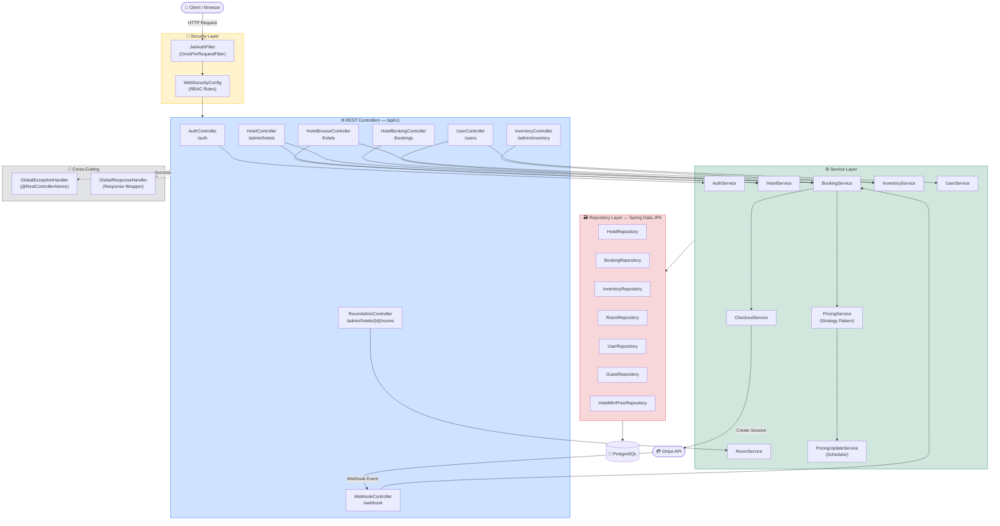

---

## 📁 Project Structure

```
src/main/java/com/adnanumar/projects/airBnbApp/
│
├── AirBnbAppApplication.java          # Entry point
│
├── advices/                           # Cross-cutting response/exception handling
│   ├── ApiError.java                  # Error payload (status, message, subErrors)
│   ├── ApiResponse.java               # Unified response wrapper with timestamp
│   ├── GlobalExceptionHandler.java    # @RestControllerAdvice — maps exceptions to HTTP codes
│   └── GlobalResponseHandler.java     # Wraps all successful responses in ApiResponse<T>
│
├── config/
│   ├── MapperConfig.java              # ModelMapper Spring bean
│   ├── OpenApiConfig.java             # Swagger / OpenAPI configuration
│   └── StripeConfig.java              # Stripe SDK initializer (reads secret key)
│
├── controller/
│   ├── AuthController.java            # /auth — signup, login, token refresh
│   ├── HotelBrowseController.java     # /hotels — public search & hotel info
│   ├── HotelController.java           # /admin/hotels — CRUD + reports (HOTEL_MANAGER)
│   ├── RoomAdminController.java       # /admin/hotels/{id}/rooms — room CRUD
│   ├── InventoryController.java       # /admin/inventory — view & update inventory
│   ├── HotelBookingController.java    # /bookings — full booking flow
│   ├── UserController.java            # /users — profile, my bookings
│   └── WebhookController.java         # /webhook/payment — Stripe event listener
│
├── dto/                               # Data Transfer Objects (request & response)
│   ├── BookingDto / BookingRequestDto
│   ├── GuestDto
│   ├── HotelDto / HotelInfoDto / HotelPriceDto / HotelReportDto / HotelSearchRequestDto
│   ├── InventoryDto / UpdateInventoryRequestDto
│   ├── LoginDto / LoginResponseDto / SignUpRequestDto
│   ├── ProfileUpdateRequestDto / UserDto
│   └── RoomDto
│
├── entity/                            # JPA entities
│   ├── Booking.java
│   ├── Guest.java
│   ├── Hotel.java
│   ├── HotelContactInfo.java          # @Embeddable — embedded in Hotel
│   ├── HotelMinPrice.java             # Cheapest room price per hotel per day (search index)
│   ├── Inventory.java                 # Per-room per-day availability record
│   ├── Room.java
│   ├── User.java                      # Implements UserDetails
│   └── enums/
│       ├── BookingStatus.java         # RESERVED → GUEST_ADDED → PAYMENTS_PENDING → CONFIRMED / CANCELLED / EXPIRED
│       ├── Gender.java
│       ├── PaymentStatus.java
│       └── Role.java                  # GUEST, HOTEL_MANAGER
│
├── exception/
│   ├── PaymentValidationException.java
│   ├── ResourceNotFoundException.java
│   └── UnAuthorisedException.java
│
├── repository/                        # Spring Data JPA interfaces
│   ├── BookingRepository.java
│   ├── GuestRepository.java
│   ├── HotelMinPriceRepository.java   # Contains paginated hotel search query
│   ├── HotelRepository.java
│   ├── InventoryRepository.java       # Custom locking queries for concurrent booking
│   ├── RoomRepository.java
│   └── UserRepository.java
│
├── security/
│   ├── AuthService.java               # signUp, login, refreshToken logic
│   ├── JwtAuthFilter.java             # OncePerRequestFilter — validates Bearer token
│   ├── JwtService.java                # Token generation & parsing (HMAC-SHA)
│   └── WebSecurityConfig.java         # SecurityFilterChain, RBAC, BCrypt
│
├── service/                           # Service interfaces
│   ├── BookingService.java
│   ├── CheckoutService.java
│   ├── HotelService.java
│   ├── InventoryService.java
│   ├── RoomService.java
│   └── UserService.java
│
├── service/impl/                      # Service implementations
│   ├── BookingServiceImpl.java        # Core booking orchestration + Stripe refunds
│   ├── CheckoutServiceImpl.java       # Creates Stripe Checkout Session
│   ├── HotelServiceImpl.java          # Hotel CRUD, activation, inventory init
│   ├── InventoryServiceImpl.java      # Search, locking, update
│   ├── PricingUpdateService.java      # Hourly scheduler — updates prices in bulk
│   ├── RoomServiceImpl.java           # Room CRUD + inventory lifecycle
│   └── UserServiceImpl.java           # Profile management
│
├── strategy/                          # Decorator-based dynamic pricing
│   ├── PricingStrategy.java           # Interface: calculatePrice(Inventory)
│   ├── BasePricingStrategy.java       # Returns room.basePrice
│   ├── SurgePricingStrategy.java      # × inventory.surgeFactor
│   ├── OccupancyPricingStrategy.java  # ×1.2 when occupancy > 80%
│   ├── UrgencyPricingStrategy.java    # ×1.15 when check-in is within 7 days
│   ├── HolidayPricingStrategy.java    # ×1.25 on holidays
│   └── PricingService.java            # Chains all strategies; calculates total for a stay
│
└── util/
    └── AppUtils.java                  # getCurrentUser() from SecurityContextHolder
```

---

## 🗄️ Data Model

### Entity Relationship Diagram

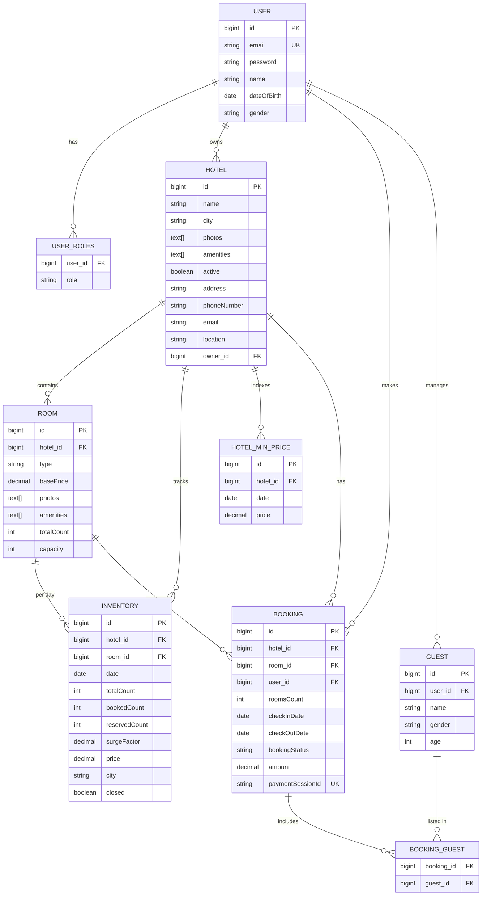

### 🔑 Unique Constraints

- `Inventory`: `(hotel_id, room_id, date)` — one record per room per day
- `Booking.paymentSessionId`: unique Stripe session reference
- `User.email`: unique login identifier

---

## 💰 Dynamic Pricing Engine

Pricing uses the **Decorator pattern**. Each strategy wraps the previous one and adds a multiplier on top. `PricingService` assembles the full chain at runtime.

### Strategy Chain Diagram

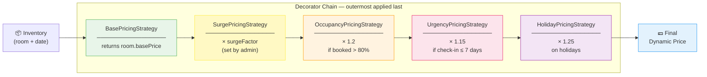

### Worst-Case Multiplier Example

> Base price ₹1,000 × surgeFactor 1.5 × occupancy 1.2 × urgency 1.15 × holiday 1.25 = **₹2,587.50**

### Pricing Update Flow

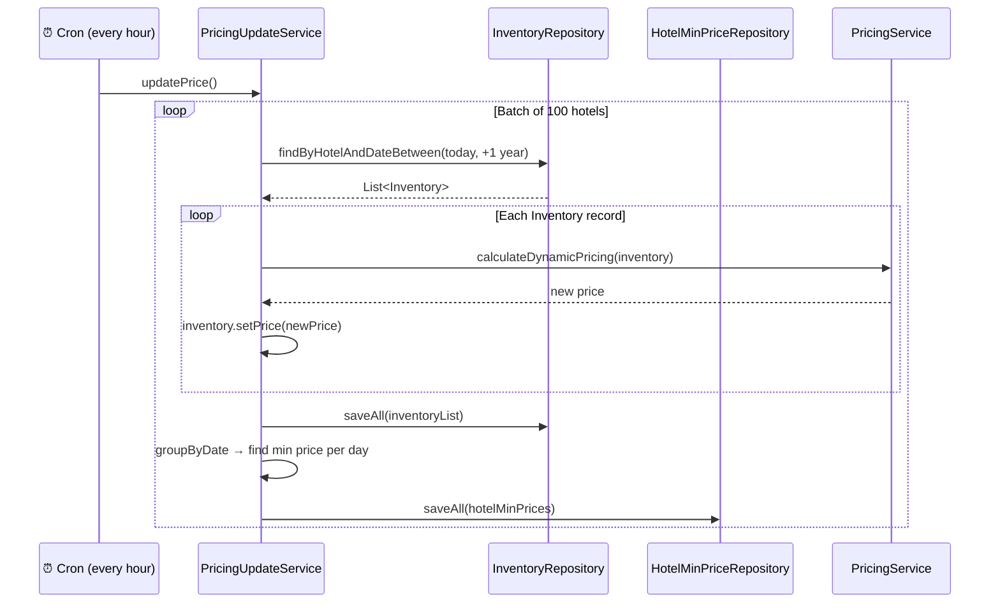

---

## 🔐 Authentication & Authorization

### 🎟️ JWT Token Strategy

| Token | Expiry | Storage |
|---|---|---|
| Access Token | 1 hour | Response body (`LoginResponseDto`) |
| Refresh Token | 6 months | HttpOnly cookie (`refreshToken`) |

Tokens are signed with HMAC-SHA using the key from `jwt.secretKey`.

### Login & Token Refresh Flow

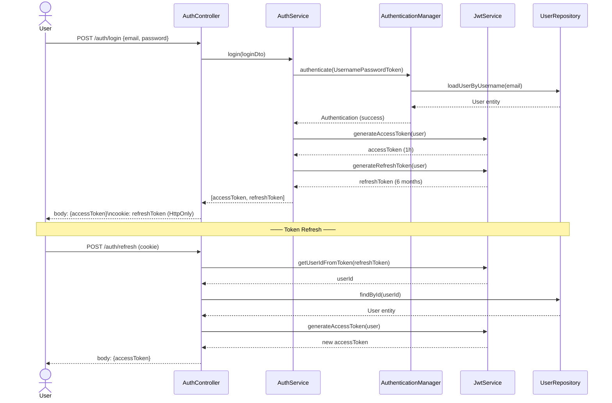

### JWT Request Filter Flow

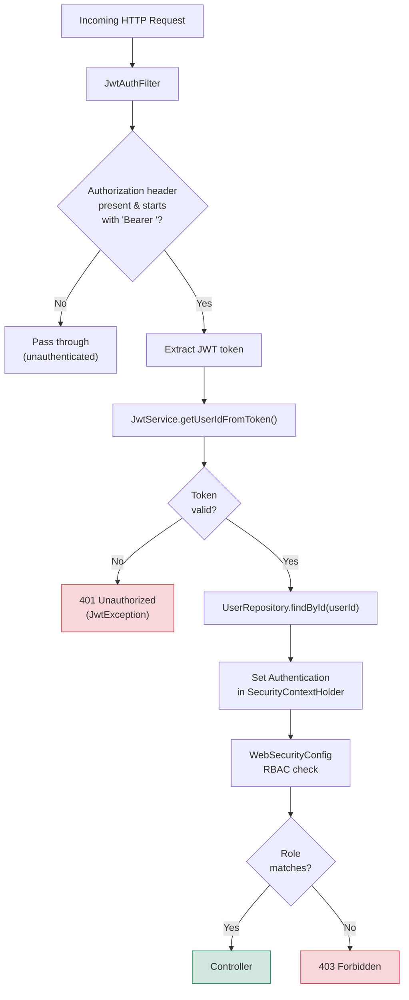

### 👥 Roles & Access

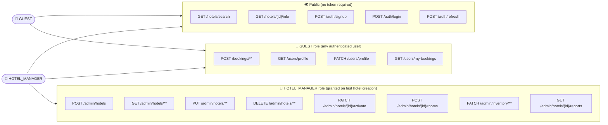

---

## 🌐 API Reference

> **Base path**: `/api/v1`  
> All responses are wrapped in `ApiResponse<T>` with a `timestamp` field.

### Full API Map

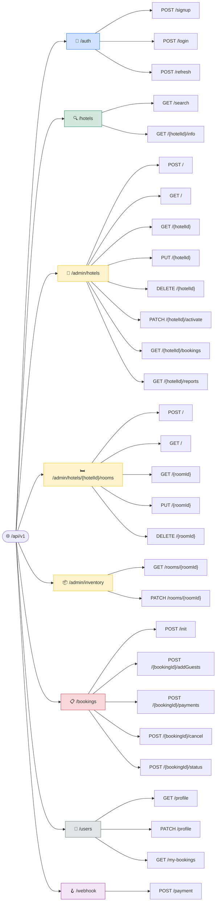

---

### 🔑 Auth — `/api/v1/auth`

| Method | Endpoint | Auth | Description |
|---|---|---|---|
| POST | `/auth/signup` | Public | Register a new user. Returns `UserDto`. |
| POST | `/auth/login` | Public | Login. Returns access token in body; refresh token set as HttpOnly cookie. |
| POST | `/auth/refresh` | Public (cookie) | Exchange refresh token cookie for a new access token. |

**Signup request body**
```json
{
  "name": "John Doe",
  "email": "john@example.com",
  "password": "secret123"
}
```

**Login response**
```json
{
  "accessToken": "<jwt>"
}
```

---

### 🔍 Hotel Browse (Public) — `/api/v1/hotels`

| Method | Endpoint | Auth | Description |
|---|---|---|---|
| GET | `/hotels/search` | Public | Paginated hotel search by city and date range. |
| GET | `/hotels/{hotelId}/info` | Public | Full hotel details with all rooms. |

**Search request body**
```json
{
  "city": "Mumbai",
  "startDate": "2025-12-20",
  "endDate": "2025-12-25",
  "roomsCount": 1,
  "page": 0,
  "size": 10
}
```

---

### 🏨 Hotel Admin — `/api/v1/admin/hotels`

> Requires `HOTEL_MANAGER` role. Hotel managers can only operate on their own hotels.

| Method | Endpoint | Description |
|---|---|---|
| POST | `/admin/hotels` | Create a hotel (sets creator as HOTEL_MANAGER). |
| GET | `/admin/hotels` | List all hotels owned by the current user. |
| GET | `/admin/hotels/{hotelId}` | Get hotel details. |
| PUT | `/admin/hotels/{hotelId}` | Update hotel. |
| DELETE | `/admin/hotels/{hotelId}` | Delete hotel and all its rooms/inventories. |
| PATCH | `/admin/hotels/{hotelId}/activate` | Activate hotel — initializes room inventory for 1 year. |
| GET | `/admin/hotels/{hotelId}/bookings` | List all bookings for the hotel. |
| GET | `/admin/hotels/{hotelId}/reports?startDate=&endDate=` | Revenue report (defaults to last 30 days). |

---

### 🛏️ Room Admin — `/api/v1/admin/hotels/{hotelId}/rooms`

> Requires `HOTEL_MANAGER` role.

| Method | Endpoint | Description |
|---|---|---|
| POST | `/admin/hotels/{hotelId}/rooms` | Create a room inside the hotel. |
| GET | `/admin/hotels/{hotelId}/rooms` | List all rooms in the hotel. |
| GET | `/admin/hotels/{hotelId}/rooms/{roomId}` | Get a specific room. |
| PUT | `/admin/hotels/{hotelId}/rooms/{roomId}` | Update room details. |
| DELETE | `/admin/hotels/{hotelId}/rooms/{roomId}` | Delete room and its inventory records. |

---

### 📦 Inventory Admin — `/api/v1/admin/inventory`

> Requires `HOTEL_MANAGER` role. Only the hotel owner can manage its room inventory.

| Method | Endpoint | Description |
|---|---|---|
| GET | `/admin/inventory/rooms/{roomId}` | Get full inventory list for a room (all dates). |
| PATCH | `/admin/inventory/rooms/{roomId}` | Update inventory for a date range — set `closed` flag and/or `surgeFactor`. |

**Update inventory request body**
```json
{
  "startDate": "2025-12-24",
  "endDate": "2025-12-26",
  "closed": false,
  "surgeFactor": 1.5
}
```

---

### 📋 Bookings — `/api/v1/bookings`

> Requires authentication. Users can only interact with their own bookings.

| Method | Endpoint | Description |
|---|---|---|
| POST | `/bookings/init` | Initialize a booking — reserves inventory and calculates price. |
| POST | `/bookings/{bookingId}/addGuests` | Add guests to a reserved booking. |
| POST | `/bookings/{bookingId}/payments` | Create a Stripe Checkout Session. Returns `sessionUrl`. |
| POST | `/bookings/{bookingId}/cancel` | Cancel a confirmed booking. Triggers Stripe refund. |
| POST | `/bookings/{bookingId}/status` | Get current booking status. |

**Init booking request body**
```json
{
  "hotelId": 1,
  "roomId": 2,
  "checkInDate": "2025-12-20",
  "checkOutDate": "2025-12-25",
  "roomsCount": 1
}
```

> ⚠️ **Note**: Bookings expire after **10 minutes** if payment is not completed.

---

### 👤 User Profile — `/api/v1/users`

| Method | Endpoint | Description |
|---|---|---|
| GET | `/users/profile` | Get the logged-in user's profile. |
| PATCH | `/users/profile` | Update profile details. |
| GET | `/users/my-bookings` | List all bookings made by the logged-in user. |

---

### 🪝 Stripe Webhook — `/api/v1/webhook/payment`

| Method | Endpoint | Description |
|---|---|---|
| POST | `/webhook/payment` | Receives Stripe events. Handles `checkout.session.completed` to confirm booking. |

The webhook validates the `Stripe-Signature` header against `stripe.webhook.secret` before processing.

---

## 🔄 Booking Lifecycle

### State Machine

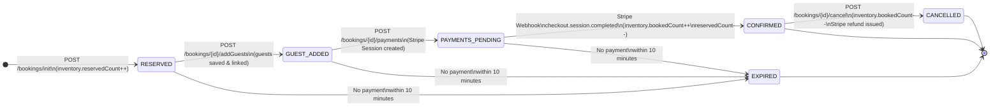

### Full Booking Sequence Diagram

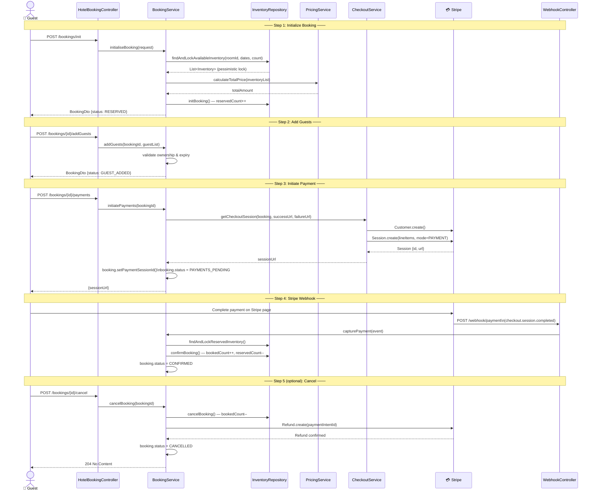

---

## ⏰ Scheduled Jobs

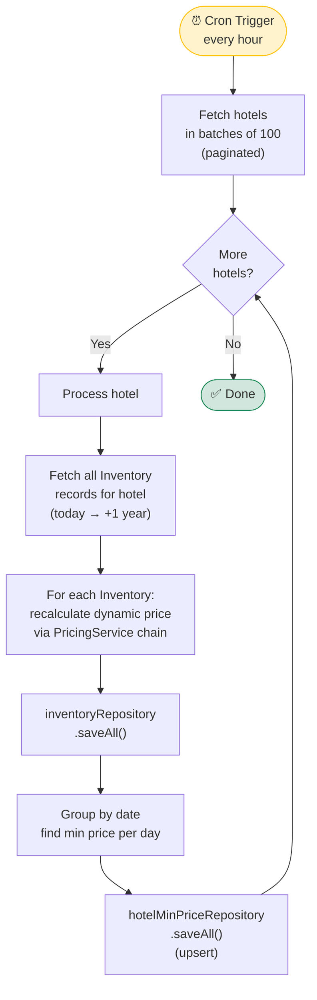

| Job | Schedule | What it does |
|---|---|---|
| `PricingUpdateService.updatePrice()` | Every hour (`0 0 * * * *`) | Processes all hotels in batches of 100. Recomputes dynamic prices for all inventory records up to 1 year ahead, then rebuilds the `HotelMinPrice` search index. |

---

## 🚨 Error Handling

All errors return a consistent `ApiResponse<T>` envelope:

```json
{
  "timeStamp": "2025-12-01T10:30:00",
  "data": null,
  "error": {
    "status": "NOT_FOUND",
    "message": "Hotel not found with ID : 99",
    "subErrors": []
  }
}
```

### Exception Mapping

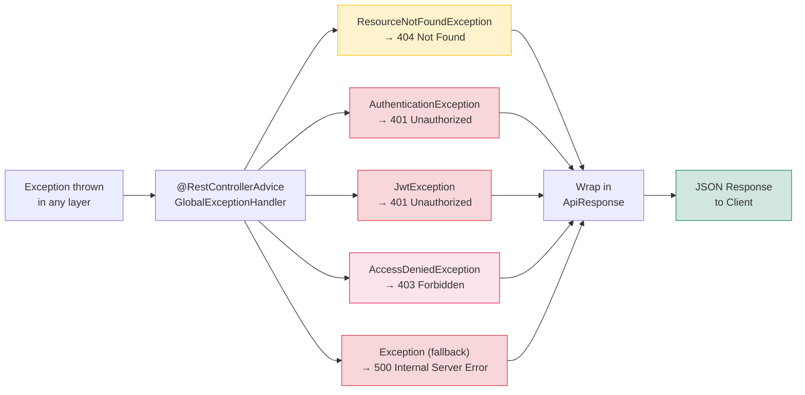

| Exception | HTTP Status |
|---|---|
| `ResourceNotFoundException` | 404 Not Found |
| `AuthenticationException` | 401 Unauthorized |
| `JwtException` | 401 Unauthorized |
| `AccessDeniedException` | 403 Forbidden |
| `Exception` (fallback) | 500 Internal Server Error |

---

## 🔧 Configuration

All sensitive values are injected via environment variables.

```yaml
# src/main/resources/application.yaml

spring:
  datasource:
    url: ${DB_URL}
    username: ${DB_USERNAME}
    password: ${DB_PASSWORD}
  jpa:
    hibernate:
      ddl-auto: update
    show-sql: true

server:
  servlet:
    context-path: /api/v1

jwt:
  secretKey: <your-secret-key>   # min 256-bit recommended

frontend:
  url: http://localhost:8080     # Stripe redirect after payment

stripe:
  secret:
    key: ${STRIPE_SECRET_KEY}
  webhook:
    secret: ${STRIPE_WEBHOOK_SECRET_KEY}
```

### 📋 Required Environment Variables

| Variable | Description |
|---|---|
| `DB_URL` | PostgreSQL JDBC URL e.g. `jdbc:postgresql://localhost:5432/airbnb` |
| `DB_USERNAME` | Database username |
| `DB_PASSWORD` | Database password |
| `STRIPE_SECRET_KEY` | Stripe secret key (`sk_test_...`) |
| `STRIPE_WEBHOOK_SECRET_KEY` | Stripe webhook signing secret (`whsec_...`) |

---

## 🚀 Running Locally

### ✅ Prerequisites

- Java 21
- Maven 3.8+
- PostgreSQL (running, with a database created)
- Stripe account (test mode keys)

### 🪜 Steps

**1. Clone the repository**
```bash
git clone <repo-url>
cd airBnbApp
```

**2. Set environment variables**
```bash
# Windows
set DB_URL=jdbc:postgresql://localhost:5432/airbnb
set DB_USERNAME=postgres
set DB_PASSWORD=your_password
set STRIPE_SECRET_KEY=sk_test_...
set STRIPE_WEBHOOK_SECRET_KEY=whsec_...

# Linux / macOS
export DB_URL=jdbc:postgresql://localhost:5432/airbnb
export DB_USERNAME=postgres
export DB_PASSWORD=your_password
export STRIPE_SECRET_KEY=sk_test_...
export STRIPE_WEBHOOK_SECRET_KEY=whsec_...
```

**3. Run the application**
```bash
./mvnw spring-boot:run
```

**4. Access Swagger UI**
```
http://localhost:8080/api/v1/swagger-ui/index.html
```

**5. Set up Stripe webhook (for local testing)**
```bash
stripe listen --forward-to localhost:8080/api/v1/webhook/payment
```

---

## 🐳 Docker

A multi-stage Dockerfile is included. The build stage uses the full Maven + JDK 21 image; the runtime stage uses a slim JRE-only image.

### Docker Build Pipeline

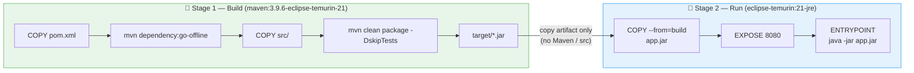

### 🔨 Build and Run

```bash
# Build the image
docker build -t airbnb-app .

# Run the container
docker run -p 8080:8080 \
  -e DB_URL=jdbc:postgresql://host.docker.internal:5432/airbnb \
  -e DB_USERNAME=postgres \
  -e DB_PASSWORD=your_password \
  -e STRIPE_SECRET_KEY=sk_test_... \
  -e STRIPE_WEBHOOK_SECRET_KEY=whsec_... \
  airbnb-app
```

> 💡 If your PostgreSQL is running on the host machine, use `host.docker.internal` (Docker Desktop) or the host's IP address as the DB host.

---

<div align="center">

Made with ❤️ by **Adnan Umar** &nbsp;·&nbsp; `com.adnanumar.projects`

</div>
